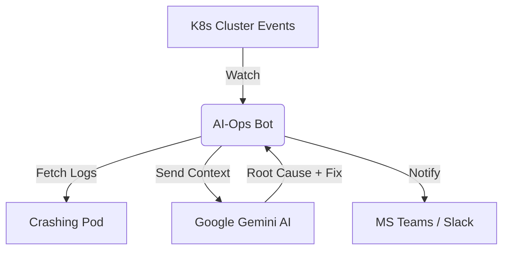

# 🤖 K8s AI-Ops: Multi-Cloud Self-Healing & Alerting

[](https://kubernetes.io/)
[](https://ai.google.dev/)
[](https://cloud.google.com/)

An intelligent, production-ready Kubernetes automation framework. This bot monitors your cluster in real-time, uses **Google Gemini AI** to analyze pod crashes/logs, and delivers human-readable root-cause analysis and "one-liner" fixes directly to **MS Teams** or **Slack**.

---

## 📑 Table of Contents
* [Features](#-features)
* [Architecture](#-architecture)
* [Prerequisites](#-prerequisites)
* [Step-by-Step Installation](#-step-by-step-installation)
* [Multi-Cloud Configuration](#-multi-cloud-configuration)
* [Environment Variables](#-environment-variables)
* [Testing the Bot](#-testing-the-bot)

---

## ✨ Features

* **🧠 AI-Powered Troubleshooting:** Automatically extracts logs from crashing pods and uses Gemini 1.5 Flash to explain *why* it failed and *how* to fix it.
* **☁️ Multi-Cloud Native:** Includes logic for **GCP**, **AWS**, and **Azure** resource management.
* **🛠️ ChatOps Integration:** Supports **MS Teams** (via Workflows) and **Slack** (via Webhooks).
* **🔒 Secure by Design:** Uses Kubernetes RBAC and Secrets; supports Cloud Identity (Workload Identity/IRSA) to avoid hardcoded keys.
* **🐳 Lightweight:** Packaged as a small Docker container using `python:slim`.

---

## 🏗 Architecture



---

## 📋 Prerequisites

Before you begin, ensure you have:
1.  **A K8s Cluster:** (GKE, EKS, AKS, or Minikube).
2.  **Gemini API Key:** Get it for free at [Google AI Studio](https://aistudio.google.com/).
3.  **Webhook URL:** * **Teams:** Create a "Workflows" webhook in your channel.
    * **Slack:** Create an "Incoming Webhook" app.

---

## 🚀 Step-by-Step Installation

### 1. Clone the Repository
```bash
git clone https://github.com/YOUR_USERNAME/k8s-ai-ops.git
cd k8s-ai-ops
```

### 2. Create Kubernetes Secrets
Store your sensitive API keys securely in the cluster.
```bash
kubectl create secret generic ai-bot-creds \
  --from-literal=GEMINI_KEY='your_gemini_api_key' \
  --from-literal=WEBHOOK_URL='your_teams_or_slack_url'
```

### 3. Apply RBAC Permissions
This allows the bot to watch events and read logs across all namespaces.
```bash
kubectl apply -f deploy/gcp/rbac.yaml
```

### 4. Deploy the Bot
Update the image path in `deploy/gcp/deploy.yaml` to your registry, then run:
```bash
kubectl apply -f deploy/gcp/deploy.yaml
```

---

## ☁️ Multi-Cloud Configuration

The bot is designed to be environment-aware. You can toggle cloud-specific logic by changing the `CLOUD_PROVIDER` environment variable in your deployment manifest.

| Provider | Value | Logic Description |
| :--- | :--- | :--- |
| **GCP** | `gcp` | Integrates with Google Artifact Registry & GKE events. |
| **AWS** | `aws` | Uses `boto3` for EBS/ELB automated cleanup logic. |
| **Azure** | `azure` | Uses Azure SDK for Managed Disk/Volume attachment fixes. |

---

## ⚙️ Environment Variables

| Variable | Description | Default |
| :--- | :--- | :--- |
| `CLOUD_PROVIDER` | `gcp`, `aws`, or `azure` | `gcp` |
| `NOTIFY_PLATFORM` | `teams` or `slack` | `teams` |
| `GEMINI_KEY` | API Key from Google AI Studio | (Required) |
| `WEBHOOK_URL` | Endpoint for Teams/Slack | (Required) |

---

## 🧪 Testing the Bot

To verify the AI-Ops bot is working, deploy a "broken" pod that is designed to crash:

```bash
kubectl run cleanup-test --image=alpine --restart=Never -- /bin/sh -c "exit 1"
```

**Check your MS Teams/Slack channel.** You should receive a message similar to:
> 🚨 **GCP Alert:** Pod `cleanup-test` failed because it exited with code 1.
> **Fix:** Check your entrypoint script or Dockerfile CMD. `kubectl delete pod cleanup-test` to clear.

---

## 🤝 Contributing
1. Fork the Project.
2. Create your Feature Branch (`git checkout -b feature/AmazingFeature`).
3. Commit your Changes (`git commit -m 'Add some AmazingFeature'`).
4. Push to the Branch (`git push origin feature/AmazingFeature`).
5. Open a Pull Request.

---

## 📄 License
Distributed under the MIT License. See `LICENSE` for more information.

---

### 🌟 Show your support
Give a ⭐️ if this project helped you!

